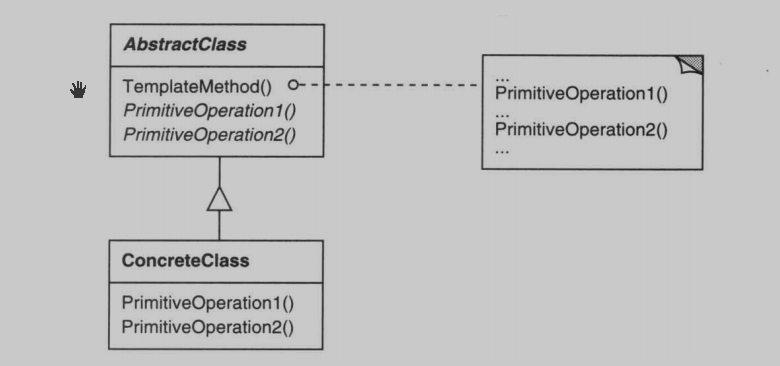
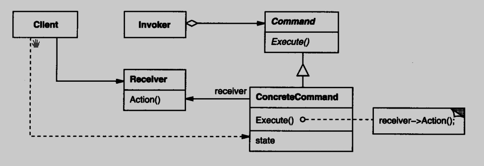
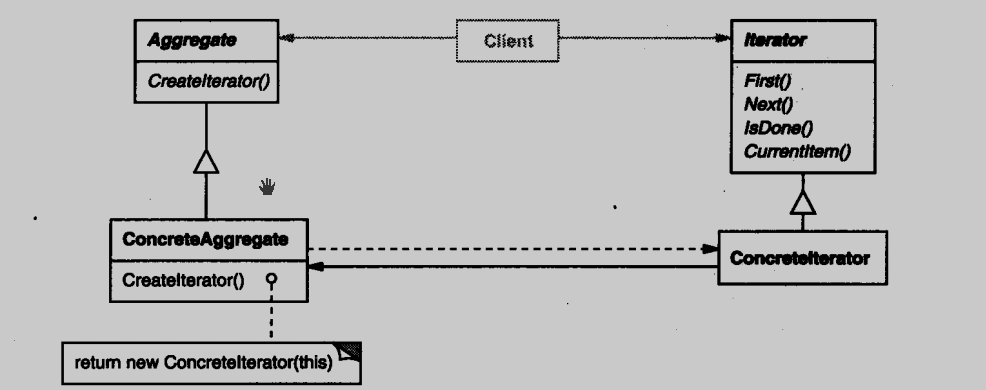
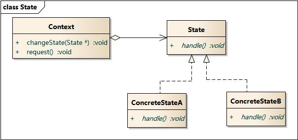
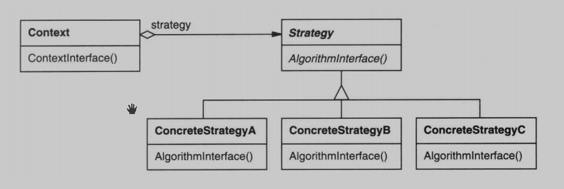

# 设计原则

### 单一职责原则 (SPR)

- 一个类应该仅有一个引起它变化的原因。

### 开放封闭原则 (OCP)

- 类模块应该是可扩展的，是不可修改的。

### 里氏替换原则 (LSP)

- 子类必须能够替换他们的基类。

### 依赖倒置原则 (DIP)

- 高层模块不应该依赖于低层模块，二者都应该依赖于抽象。

- 抽象不应该依赖于实现细节，实现细节应该依赖于抽象。

### 接口隔离原则 (ISP)

- 不应该强迫客户程序依赖于它们不用的方法。

### 三大基本面向对象设计原则

- 针对接口编程，而不是针对实现编程：客户代码无需知道所使用的对象的特定类型，只需要知道对象拥有客户所期望的接口。
- 优先使用对象组合，而不是类继承：类继承通常为 "白盒复用"，对象组合通常为"黑盒复用"。继承在某种程度上破坏了封装性，子类和父类耦合度高；而对象组合则只要求被组合的对象具有良好定义的接口，耦合度低。
- 封装变化点：使用封装来创建对象之间的分界层，让设计者可以在分界层的一侧进行修改，而不会对另一侧产生不良的影响，从而实现层次间的松耦合。

-------------------

# 模式总结

### 创建型模式

- `Singleton` 模式解决的是实体对象个数的问题。除了`Singleton`之外，其他创建型模式解决的都是 `new` 所带来的耦合关系。
- `Factory Method`、`Abstract Factory`、`Builder` 都是需要一个额外的工厂类来负责实例化 "易变对象"，而 `Prototype` 则是通过原型(一个特殊的工厂类) 来克隆 "易变对象"。
- 如果遇到 "易变类"，起初的设计通常从`Factory Method` 开始，当遇到更多的复杂变化时，再考虑重构为其他三种工厂模式(`Abstract Factory`、`Builder`、`Prototype`)。

### 结构型模式

- `Adapter` 模式注重转换接口，将不吻合的接口适配对接。
- `Bridge` 模式注重分离接口与其实现，支持多维度变化。
- `Composite` 模式注重统一接口，将 "一对多" 的关系转换为"一对一"的关系。
- `Decorator` 模式注重稳定接口，在此前提下为对象扩展功能。
- `Facade` 模式注重简化接口，简化组件系统与外部客户程序的依赖关系。
- `Flyweight` 模式注重保留接口，在内部使用共享技术对对象存储进行优化。
- `Proxy` 模式注重假借接口，增加间接层来实现灵活控制。

### 行为型模式

- `Template Mehtod` 模式封装算法结构，支持算法子步骤变化。
- `Strategy` 模式注重封装算法，支持算法的变化。
- `State` 模式注重封装与状态相关的行为，支持状态的变化。
- `Memento` 模式注重封装对象状态变化，支持状态保存/恢复。
- `Mediator` 模式注重封装对象间的交互，支持对象交互的变化。
- `Chain Of Responsibility` 模式注重封装对象责任，支持责任的变化。
- `Command` 模式注重将请求封装为对象，支持请求的变化。
- `Iterator` 模式注重封装集合对象内部结构，支持集合的变化。
- `Interpreter` 模式注重封装特定领域变化，支持领域问题的频繁变化。
- `Observer` 模式注重封装对象通知，支持通信对象的变化。
- `Visitor` 模式注重封装对象操作变化，支持在运行时为类层次结构动态添加新的操作。

--------------------

# 创建型
## 单例模式 *
### 意图 
单例模式（Singleton Pattern）是一种创建型设计模式，它确保一个类只有一个实例，并提供一个全局访问点来访问这个实例。单例模式可以避免多个实例的创建，节省系统资源，同时也确保所有的访问都指向同一个实例。

### 实现方式

- 饿汉式单例：在类加载时就创建实例，保证了线程安全，但可能造成资源浪费。
- 懒汉式单例：在需要时才创建实例，节省了资源，但需要注意线程安全问题。
- 双重检查锁单例：结合了饿汉式和懒汉式的优点，实现了懒加载和线程安全。
- 静态内部类单例：利用了类加载的特性，实现了懒加载和线程安全。
- 枚举单例：利用Java中的枚举类型实现单例，是最简洁、高效、线程安全的单例实现方式。

### 优点

- 保证一个类只有一个实例，节省了系统资源。
- 提供了一个全局访问点，方便对实例的访问。

### 适用场景

- 当一个类只需要一个实例，并且多个访问点需要共享这个实例时，可以使用单例模式。

--------------
## 抽象工厂模式 *
### 意图 
抽象工厂模式`(Abstract Factory Pattern)`是一种创建型设计模式，它提供了一组相关对象的创建操作，封装在一个工厂中的方式。抽象工厂模式可以创建一族相关或相互依赖的对象，而不需要指定其具体类。

### 角色

- 抽象工厂`(Abstract Factory)`：声明一组用于创建抽象产品的方法，每个方法对应一种产品。
- 具体工厂`(Concrete Factory)`：实现抽象工厂接口，负责创建一族相关的具体产品。
- 抽象产品`(Abstract Product)`：声明产品的接口，可以是抽象类或接口。
- 具体产品`(Concrete Product)`：实现抽象产品接口，是一族相关产品中的某一种。

### 优点

- 将一族相关产品的创建集中到一个工厂中，使得客户端代码与具体产品的创建解耦，提高了代码的灵活性和可维护性。
- 符合开闭原则，新增产品只需要扩展工厂和产品接口，不需要修改现有代码。

### 适用场景

- 当有多个相关的产品族需要创建时，可以使用抽象工厂模式。
- 当系统中的一族产品经常需要进行扩展时，可以使用抽象工厂模式。

-----

##  建造者模式 *
### 意图 
建造者模式（Builder Pattern）是一种创建型设计模式，它可以将复杂对象的构建过程与表示分离，使得同样的构建过程可以创建不同的表示。建造者模式适用于创建复杂的对象，它通过一步一步地构建，最终得到一个完整的对象。

### 模式结构

- 产品（Product）：表示最终构建的复杂对象，通常由多个部分组成。
- 抽象建造者（Builder）：定义创建产品各个部分的抽象方法，以及返回最终构建结果的方法。
- 具体建造者（Concrete Builder）：实现抽象建造者接口，负责构建产品的各个部分，并返回最终构建结果。
- 指挥者（Director）：负责调用具体建造者的方法来构建产品，并定义构建的顺序和逻辑。

### 优点

- 将复杂对象的构建过程与表示分离，使得构建过程更加灵活，可以创建不同的表示。
- 可以隐藏产品的内部结构，使得客户端只需关心产品的最终结果。

### 试用场景

- 当需要创建复杂对象，且创建过程较为稳定时，可以使用建造者模式。
- 当一个对象有多种表示，而且表示的创建过程相同，但顺序或步骤有差异时，可以使用建造者模式。

--------------
## 工厂方法模式 *
### 意图
工厂方法模式（Factory Method Pattern）是一种创建型设计模式，它定义了一个用于创建对象的接口，但具体的对象创建由子类决定。工厂方法模式使得一个类的实例化延迟到其子类。

### 模式结构

- 抽象产品（Abstract Product）：定义产品的接口，是工厂方法模式所创建的对象的超类型。
- 具体产品（Concrete Product）：实现抽象产品接口，是具体的产品对象。
- 抽象工厂（Abstract Factory）：定义创建抽象产品的方法，是工厂方法模式的核心接口。
- 具体工厂（Concrete Factory）：实现抽象工厂接口，负责创建具体产品。

### 优点

- 将对象的创建和使用分离，客户端不需要关心具体产品的创建细节，只需通过抽象工厂来创建产品。
- 符合开闭原则，新增产品只需要扩展具体工厂和具体产品类，不需要修改现有代码。

### 适用场景

- 当一个类无法预知它所必须创建的对象的类时，可以使用工厂方法模式。
- 当一个类希望由它的子类来指定它所创建的对象时，可以使用工厂方法模式。

--------------
## 原型模式 
### 意图 
原型模式（Prototype Pattern）是一种创建型设计模式，它通过复制已有对象来创建新对象，而无需知道新对象的具体类型。原型模式通过克隆现有对象来创建新对象，从而避免了通过类构造函数创建对象的复杂性。

### 模式结构

- 原型接口（Prototype）：定义克隆方法的接口。
- 具体原型类（Concrete Prototype）：实现原型接口，实现克隆方法，用于复制自身。
- 客户端（Client）：使用原型对象克隆来创建新对象。

### 优点

- 通过克隆现有对象来创建新对象，避免了类构造函数的复杂性。
- 可以动态添加和删除产品的具体实现，客户端无需修改代码。

### 适用场景

- 当一个系统需要创建大量相似对象时，可以使用原型模式来提高效率。
- 当一个对象的构造函数较为复杂，而且多个对象之间存在较多的共同属性时，可以使用原型模式。

---

# 结构型
## 适配器模式 *
### 模式意图 
- 适配器模式 (Adapter Pattern) 是一种结构型设计模式，用于将一个类的接口转换成客户端所期望的另一个接口。适配器模式使得原本由于接口不兼容而不能一起工作的类可以协同工作。

### 模式要点

- 适配器模式主要应用于`希望复用一些现存的类`，但是接口又与复用环境要求不一致的情况，在遗留代码复用、类库迁移等方面非常有用。
- GoF23 定义了两种适配器模式的实现结构：对象适配器和类适配器。但类适配器采用`多继承`的实现方式，带来了不良的高耦合，所以一般不推荐使用。对象适配器采用`对象组合`的方式，更符合松耦合精神。
- 适配器模式可以实现的非常灵活，不必拘泥于GoF23中定义的两种结构。例如，完全可以将适配器模式中的`现存对象`作为新的接口方法参数，来达到适配的目的。
- 适配器模式本身要求我们尽可能地使用`面向接口的编程`风格，这样才能在后期很方便地适配。

### 模式结构
- 目标接口 (Target)：定义客户端所期望的接口。
- 被适配者 (Adaptee)：需要被适配的类或接口，它原本的接口和客户端所期望的接口不兼容。
- 适配器 (Adapter)：将被适配者的接口转换成客户端所期望的接口。

### 适用场景

- 现有接口不匹配：当已有的类或接口的方法和需要的接口不一致时，可以使用适配器模式来创建一个适配器，使它们能够在一起工作。
- 类重用：如果你有一个已有的类，它的功能很适合你的应用，但其接口与你的代码要求不同，那么你可以使用适配器模式，而不必修改这个类的源代码。

--------------
## 桥接模式 *
### 模式意图 
- 桥接模式（Bridge Pattern）是一种结构型设计模式，它将抽象部分和实现部分相分离，使它们可以独立地变化。桥接模式通过将继承关系转化为组合关系来实现这种分离，从而可以灵活地扩展和修改系统的功能。

### 模式要点
- 桥接模式使用`对象间的组合关系`来解耦抽象和实现之间固有的绑定关系，使得`抽象`（Tank的型号）和`实现`（不同的平台）可以沿着各自的维度变化。
- 所谓抽象和实现沿着各自维度变化，即`子类化`它们，比如不同的Tank型号子类，和不同的平台子类。得到各个子类之后，便可以任意组合它们，从而获得不同平台上的不同型号。
- 桥接模式有时类似于多继承方案，但是多继承方案往往违背单一职责原则（即一个类只有一个变化的原因），复用性比较差，桥接模式是比多继承方案更好的解决方法。
- 桥接模式的应用一般在`两个非常强的变化维度`，有时候即使有两个变化的维度，但是某个方向的变化维度并不剧烈，换言之两个变化不会导致纵横交错的结果，并不一定要使用桥接模式。

### 模式优点
- 分离抽象部分和实现部分，使得它们可以独立变化，增加系统的灵活性和可扩展性。
- 减少了类之间的耦合，提高了代码的可维护性和可读性。
- 适用于`多维度变化`的场景，可以轻松添加新的抽象部分和实现部分，而无需修改现有代码。

---

## 装饰器模式 *
### 模式意图
装饰器模式 (Decorator Pattern) 是一种结构型设计模式，它允许你动态地将新功能添加到对象中，同时保持原有对象的结构不变。装饰者模式通过使用组合关系来实现这种功能扩展，而不是通过继承关系，从而避免了类爆炸问题。

### 模式要点

- 通过采用组合、而非继承的手法，装饰器模式实现了在运行时，动态地扩展对象功能的能力，而且可以根据需求扩展多个功能。避免了单独使用继承带来的`灵活性差`和`多子类衍生问题`。
- `Component` 类在装饰器模式中充当抽象接口的角色，不应该去实现具体的行为。而且 `Decorator` 类对于 `Component` 类应该透明，换言之 `Component` 类无需知道 `Decorator` 类，`Decorator` 类是从外部来扩展`Component`类的功能。
- `Decorator` 类在接口上表现为 `is-a Component` 的继承关系，即 `Decorator` 类继承了 `Component` 类所具有的接口，但在实现上又表现为 `has-a Component` 的组合关系，即 `Decorator` 对象来装饰一个 `Component` 对象，且装饰后的对象仍然是一个 `Component` 对象。
- 装饰器模式并非解决`多子类衍生的多继承`问题，装饰器模式应用的要点在于解决`主体类在多个方向上的扩展功能`，是为`装饰`的含义。

### 模式结构
- 抽象构件（Component）：定义装饰者和被装饰者的公共接口，可以是抽象类或接口。
- 具体构件（ConcreteComponent）：实现抽象构件接口，是被装饰者，它是需要被动态添加功能的原始对象。
- 抽象装饰者（Decorator）：继承自抽象构件，具有一个指向抽象构件的引用，并实现了抽象构件的接口。
- 具体装饰者（ConcreteDecorator）：继承自抽象装饰者，是具体的装饰器实现类，用于动态地添加新功能。

### 适用性
- 在不影响原有对象的情况下，动态地扩展其功能。

--------------
## 代理模式 *
### 模式意图
代理模式（Proxy Pattern）是一种结构型设计模式，通过代理对象来控制对真实对象的访问。代理模式在客户端和真实对象之间引入了一个代理对象，客户端通过代理对象来访问真实对象，从而可以在访问过程中增加一些额外的功能，如权限控制、缓存、延迟加载等。

### 模式要点

- `增加一层间接层`是软件系统中对许多复杂问题的一种常见解决方法。在面向对象系统中，直接使用某些对象会带来许多问题，作为间接层的代理对象便是解决这一问题的常用手段。
- 具体代理模式的实现方法、实现粒度都相差很大，有些可能对单个对象做细粒度的控制，如 `copy-on-write` 技术，有些可能对组件模块提供抽象代理层，在架构层次对对象做代理。
- 代理并不一定要求保持接口的一致性，只要能够实现间接控制，有时候损及一些透明性是可以接受的。

### 模式结构

- 抽象主题（Subject）：定义真实主题和代理主题的公共接口，客户端通过该接口访问真实主题。
- 真实主题（Real Subject）：表示真正的业务逻辑，它实现了抽象主题接口。
- 代理主题（Proxy Subject）：包含一个指向真实主题的引用，并实现了抽象主题接口。代理对象在访问真实主题前后可以添加一些额外的逻辑。

### 模式优点

- 代理模式可以隐藏真实主题的具体实现，保护真实主题免于直接被访问。
- 代理模式可以在访问真实主题前后增加一些额外的功能，如权限验证、缓存等。
- 代理模式符合开闭原则，可以在不修改真实主题的情况下扩展代理对象的功能。

### 适用场景

- 当真实主题的创建和销毁非常消耗资源时，可以使用代理模式进行延迟加载。
- 当需要控制对真实主题的访问权限时，可以使用代理模式进行权限验证。
- 当需要在访问真实主题前后执行一些额外操作时，可以使用代理模式。

--------------

## 组合模式 (composite)
### 意图 
组合模式（Composite Pattern）是一种结构型设计模式，它允许你将对象组合成树形结构以表示 `部分-整体` 的层次结构。组合模式使得客户端可以一致地处理单个对象和组合对象，从而简化了代码和操作。

### 模式结构
- 组件(Component)：定义组合对象和叶子对象的公共接口，可以是抽象类或接口。
- 叶子对象(Leaf)：表示组合中的叶子节点，它没有子节点。
- 组合对象(Composite)：表示组合中的复合节点，它包含子节点，并实现了组件接口的方法。

--------------

## 外观模式 (facade)
### 意图 
Facade 模式是一种结构型设计模式，它提供了一个简单的接口，用于访问复杂子系统的一组接口。Facade 模式通过将复杂的子系统隐藏在一个高层接口后面，使得客户端可以更加方便地使用子系统，同时降低了客户端与子系统之间的耦合性。

### 模式结构

- Facade（外观）：提供一个简单的高层接口，用于隐藏子系统的复杂性。客户端通过调用 Facade 接口来访问子系统。
- 子系统（Subsystems）：实现子系统的一组接口，包含了复杂的功能和逻辑。Facade 将客户端的请求委派给子系统进行处理。

### 适用性

- 当一个复杂子系统有多个接口，并且它们之间存在依赖关系时，可以使用 Facade 模式来提供一个统一的接口，简化客户端的调用。
- 当需要对子系统进行重构或优化时，Facade 模式可以将变化隔离在外观之后，不影响客户端的调用。

--------------
## 享元模式 (flyweight)
### 意图 
享元模式（Flyweight Pattern）是一种结构型设计模式，它用于减少创建大量相似对象的内存消耗。享元模式通过共享对象来减少内存使用，从而提高系统的性能和效率。

### 模式结构

- 享元工厂（Flyweight Factory）：负责创建和管理享元对象，通常实现为一个工厂类，它维护一个享元池（Flyweight Pool）来存储已经创建的享元对象。
- 享元对象（Flyweight）：表示可共享的对象，它包含内部状态和外部状态。内部状态是固定且可以共享的部分，而外部状态是不固定的，需要在使用时通过参数传入。
- 非共享对象（Unshared Concrete Flyweight）：表示不可共享的对象，通常在享元对象无法满足要求时创建。

### 模式优点

- 减少内存消耗：通过共享对象来减少内存使用，特别适合存在大量相似对象的场景。
- 提高性能：可以减少对象创建的开销，提高系统的性能和效率。
- 分离内部状态和外部状态：将对象的内部状态和外部状态分离，使得对象的状态管理更加灵活。

### 适用场景

- 当一个系统需要大量相似的对象，且对象的内部状态可以共享时，可以通过使用享元模式来减少内存消耗。
- 当需要缓存对象，以提高性能时，可以使用享元模式来管理缓存。

--------------

# 行为型
## 责任链模式*
### 模式意图
责任链模式（Chain of Responsibility Pattern）是一种行为型设计模式，它允许你将请求沿着处理链传递，直到有一个处理者能够处理这个请求为止。这种模式将接收者对象连接成一条链，请求在链上传递，直到有一个接收者能够处理它。

### 模式动机
- 在软件构建过程中，一个请求可能被多个对象处理，但是每个请求在运行时只能有一个接受者，如果显式指定，将必不可少地带来请求发送者与接受者的紧耦合。
- 如何使请求的发送者不需要指定具体的接受者？让请求的接受者自己在运行时决定来处理请求，从而使两者解耦。

### 模式要点
- 责任链模式的应用场合在于"一个请求可能有多个接受者，但是最后真正的接受者只有一个"，只有这时候请求发送者与接受者的耦合才有可能出现"变化脆弱"的症状，责任链的目的就是将二者解耦，从而更好地应对变化。
- 应用了责任链模式后，对象的职责分派将更具灵活性。我们可以在运行时动态添加/修改请求的处理职责。
- 如果请求传递到职责链的末尾仍得不到处理，应该有一个合理的缺省机制。这也是每一个接受对象的责任，而不是发出请求的对象的责任。

### 模式适用性
- 有多个的对象可以处理一个请求，哪个对象处理该请求运行时刻自动确定。
- 你想在不明确指定接收者的情况下，向多个对象中的一个提交一个请求。
- 可处理一个请求的对象集合应被动态指定。

----------------------------
## 模板方法模式*

### 模式意图

定义一个操作中算法的骨架，而将一些步骤延迟到子类中。 模板方法使得`子类`可以不改变一个算法的结构，即可重定义该算法的某些特定步骤。

### 模式要点

- 模板方法模式是一种非常基础性的设计模式，在面向对象系统中有着大量的应用。它用最简洁的机制(虚函数的多态性)为很多应用程序框架提供了灵活的扩展点，是代码复用方面的基础实现结构。
- 除了可以灵活应对子步骤的变化外，"不用调用我，让我来调用你"的方向控制结构是模板方法的典型应用。
- 在具体实现方面，被模板方法调用的虚方法可以具有实现，也可以没有任何实现(抽象方法、纯虚方法)，但一般推荐将它们设置为protected方法。

### 模式动机

- 在软件构造过程中，对于某一项任务，它常常有稳定的整体操作结构，但各个子步骤却有很多改变的需求，或者由于固有的原因(比如框架与应用之前的关系)而无法和任务的整体结构同时实现。
- 如何在确定稳定操作结构的前提下，来灵活应对各个子步骤的变化或者晚期实现需求?

### 模型结构

- 抽象类(AbstractClass)：定义抽象的原语操作(primitive operation)，具体的子类将重定义它们来实现一个算法的各步骤。实现一个模板方法，定义一个算法的骨架。该模板方法不仅调用原语操作，也调用定义在AbstractClass或其他对象中的操作。
- 具体类(ConcreteClass)：实现原语操作以完成算法中与特定子类相关的步骤。

### 模式适用性

- 一次性实现一个算法的不变的部分，并将可变的行为留给子类实现。
- 各子类中公共的行为应该被提取出来并集中到一个公共父类中以避免重复代码。这是"重分解以一般化"的一个很好的例子。首先识别现有代码中的不同之处，并且将不同之处分离为新的操作。最后，用一个调用这些新的操作的模板方法来替换这些不同的代码。
- 控制子类扩展，模板方法只在特定的点调用"钩子"操作，因此只允许在这些点进行扩展。

---

## 命令模式

### 意图
将一个请求封装为一个对象，从而使你可用不同的请求对客户进行参数化；对请求排队或记录请求日志，以及支持可撤消的操作。

### 动机
- 在软件构建过程中，"行为请求者"与"行为实现者"通常呈现一种"紧耦合"。但在某些场合,比如需要对行为进行"记录、撤销/重做(undo/redo)、事务"等处理，这种无法抵御变化的紧耦合是不合适的。
- 在这种情况下，如何将"行为请求者"与"行为实现者"解耦？将一组行为抽象为对象，可以实现二者之间的松耦合。

### 要点
- command 模式的根本目的在于将 "行为请求者" 与 "行为实现者" 解耦，在面向对象语言中，常见的实现手段是 "将行为抽象为对象"。
- 实现 command 接口的具体命令对象 ConcreteCommand 有时候根据需要可能会保存一些额外的状态信息。
- 通过使用 composite 模式，可以将多个"命令" 封装为一个 "复合命令 MacroCommand"。

### 模式结构
- 客户(Client)：创建一个具体命令对象并设定它的接收者。
- 命令(Command)：声明执行操作的接口。
- 具体命令(ConcreteCommand)：将一个接收者对象绑定于一个动作。调用接收者相应的操作，以实现Execute。
- 调用者(Invoker)：要求该命令执行这个请求。
- 被调用者(Receiver)：知道如何实施与执行一个请求相关的操作。任何类都可能作为一个接收者。

### 协作
- Client 创建一个 ConcreteCommand 对象并指定它的 Receiver 对象。
- 某个 Invoker 对象存储该 ConcreteCommand 对象。
- 该 Invoker 通过调用 Command 对象的 Execute 操作来提交一个请求，若该命令是可撤销的，ConcreteCommand 就在执行Execute操作之前存储当前状态来用于取消该命令。
- ConcreteCommand 对象调用它的 Receiver 的一些操作来执行该请求。

--------------------------
## 解释器模式
### 意图：
给定一个语言，定义它的文法的一种表示，并定义一个解释器，这个解释器使用该表示来解释语言中的句子。

---------------------------
## 迭代器模式*
### 意图
提供一种方法顺序访问一个聚合对象中各个元素 , 而又不需暴露该对象的内部表示。

### 动机
- 在软件构建过程中，集合对象内部结构常常变化各异。但对于这些集合对象，我们希望在不暴露其内部结构的同时，可以让外部客户代码透明地访问其中包含的元素；同时这种 "透明遍历"也为"同一种算法在多种集合对象上进行操作"提供了可能。
- 使用面向对象技术将这种遍历机制抽象为 "迭代器对象" 为 "应对变化中的集合对象" 提供了一种优雅的方式。

### 模式结构
- 迭代器(Iterator)：迭代器定义访问和遍历元素的接口。
- 具体迭代器(ConcreteIterator)：具体迭代器实现迭代器接口，对该聚合遍历时跟踪当前位置。
- 聚合对象(Aggregate)：聚合定义创建相应迭代器对象的接口。
- 具体聚合对象(ConcreteAggregate)：具体聚合实现创建相应迭代器的接口，该操作返回ConcreteIterator的一个适当的实例。

### 协作
- ConcreteIterator跟踪聚合中的当前对象，并能够计算出待遍历的后继对象。

### 适用性
- 访问一个聚合对象的内容而无需暴露它的内部表示。
- 支持对聚合对象的多种遍历。
- 为遍历不同的聚合结构提供一个统一的接口(即支持多态迭代)。

### 要点
- 迭代抽象：访问一个聚合对象的内容而无需暴露它的内部表示。
- 迭代多态：为遍历不同的集合结构提供一个统一的接口，从而支持同样的算法在不同的集合结构上进行操作。
- 迭代器的健壮性考虑：遍历的同时更改迭代器所在的集合结构，会导致问题。

---------------
## 中介者模式
**意图：** 用一个中介对象来封装一系列的对象交互。中介者使各对象不需要显式地相互引用，从而使其耦合松散，而且可以独立地改变它们之间的交互。

--------------
## 备忘录模式
### 意图
在不破坏封装性的前提下，捕获一个对象的内部状态，并在该对象之外保存这个状态。这样以后就可将该对象恢复到原先保存的状态。

---------
## 观察者模式 *
### 意图 
定义对象间的一种一对多的依赖关系 ,当一个对象的状态发生改变时 , 所有依赖于它的对象都得到通知并被自动更新。

-----------------
## 状态模式*
### 意图
允许一个对象在其内部状态改变时改变它的行为，对象看起来似乎修改了它的类。

### 动机
- 在软件构建过程中，某些对象的状态如果改变，其行为也会随之而发生变化，比如文档处于"只读状态"，其支持的行为和"读写状态"支持的行为就可能完全不同。
- 如何在运行时根据对象的状态来透明地更改对象的行为?而不会为对象操作和状态转化之间引入紧耦合?

### 要点
- 状态模式将所有与一个特定状态相关的行为都放入一个State的子类对象中，在对象状态切换时，切换相应的对象；但同时维持State的接口，这样实现了具体操作与状态转换之间的解耦。
- 为不同的状态引入不同的对象使得状态转换变得更加明确，而且可以保证不会出现状态不一致的情况，因为转换是原子性的，即要么彻底转换过来，要么不转换。
- 如果State对象没有实例变量，那么各个上下文可以共享同一个State对象，从而节省对象开销。

### 模式结构
- 环境(Context)：定义了客户感兴趣的接口，维护一个当前状态，并将与状态相关的操作委托给当前状态对象来处理。
- 抽象状态(State)：定义一个接口用来封装与 Context 的一个特定状态相关的行为。
- 具体状态(ConcreteState)：每一个子类实现一个与 Context 的一个状态相关的行为。

### 协作
- Context 将与状态相关的请求委托给当前的 ConcreteState 对象处理。
- Context 可将自身作为一个参数传递给处理该请求的状态对象。这使得状态对象在必要时可访问 Context。
- Context 是客户使用的主要接口，客户可用状态对象来配置一个Context，一旦一个 Context 配置完毕，它的客户不再需要直接与状态对象打交道。
- Context 或 ConcreteState子类都可决定哪个状态是另外哪一个的后继者，以及是在何种条件下进行状态转换。

--------------
## 策略模式*
### 意图 
定义一系列的算法，把它们一个个封装起来，并且使它们可以相互替换，本模式使得算法可独立于使用它的客户而变化。

### 动机
- 在软件构建过程中，某些对象使用的算法可能多种多样，经常改变，如果将这些算法都编码到对象中，将会使对象变得异常复杂，而且有时候支持不使用的算法也是一种性能负担。
- 如何在运行时根据需要透明地更改对象的算法？将算法与对象本身解耦，从而避免上述问题？

### 要点
- Strategy 及其子类为组件提供了一系列可重用的算法，从而可以使得类型在运行时方便地根据需要在各个算法之间进行切换，所谓封装算法，支持算法的变化。
- Strategy 模式提供了用条件判断语句以外的另一种选择，消除条件判断语句，就是在解耦合，含有许多条件判断语句的代码通常都需要 Strategy 模式。
- 与 State 类似，如果 Strategy 对象没有实例变量，那么各个上下文可以共享同一个 Strategy 对象，从而节省对象开销。

### 模式结构
- 策略(Strategy)：定义所有支持的算法的公共接口。Context使用这个接口来调用某个ConcreteStrategy定义的算法。
- 具体策略(ConcreteStrategy)：以Strategy接口实现某具体算法。
- 上下文(Context)：用一个ConcreteStrategy对象来配置；维护一个对Strategy对象的引用；可定义一个接口来让Strategy访问它的数据。

### 协作
- Strategy 和 Context 相互作用以实现选定的算法。当算法被调用时，Context 可以将该算法所需的所有数据都传递给该 Strategy。或者，Context 可以将自身作为一个参数传递给Strategy操作。这就让Strategy在需要时可以回调Context。
- Context 将它的客户的请求转发给它的Strategy。客户通常创建并传递一个ConcreteStrategy对象给Context；这样，客户仅与Context交互。通常有一系列的ConcreteStrategy类可供客户从中选择。

### 适用性：当存在以下情况时使用 Strategy 模式
- 许多相关的类仅仅是行为有异。"策略"提供了一种用多个行为中的一个行为来配置一个类的方法。
- 需要使用一个算法的不同变体，例如，你可能会定义一些反映不同的空间/时间权衡的算法。当这些变体实现为一个算法的类层次时，可以使用策略模式。
- 算法使用客户不应该知道的数据。可使用策略模式以避免暴露复杂的、与算法相关的数据结构。
- 一个类定义了多种行为，并且这些行为在这个类的操作中以多个条件语句的形式出现。将相关的条件分支移入它们各自的Strategy类中以代替这些条件语句。

------------
## 访问者模式
### 意图

访问者模式（Visitor Pattern）是一种行为型设计模式，它允许在不修改被访问元素的类的情况下，定义新的操作并应用于这些元素。

访问者模式的核心思想是将数据结构与对数据的操作分离开来，从而使操作能够独立地变化。它通过将具体的操作封装在访问者对象中，访问者对象可以根据需要在不同的元素上执行操作，而不用修改元素的类。

### 模式结构

- 抽象元素（Element）：定义一个接受访问者对象的接口，所有具体元素都实现这个接口。
- 具体元素（ConcreteElement）：实现抽象元素接口，表示被访问的具体元素。
- 抽象访问者（Visitor）：定义访问者对象的接口，声明可以访问哪些具体元素。
- 具体访问者（ConcreteVisitor）：实现抽象访问者接口，表示对具体元素的操作。
- 对象结构（ObjectStructure）：管理元素对象的集合，通常提供了遍历元素集合的方法，让访问者对象能够访问其中的元素。

### 优点

- 增加新的操作很方便，无需修改被访问元素的类，符合开闭原则。
- 将相关的操作封装在访问者中，便于管理和维护。

### 适用场景

- 当一个数据结构中的元素类的个数很少改变，但经常需要在这些元素上定义新的操作时，可以使用访问者模式。
- 当一个数据结构中的元素类的个数经常改变，但不希望在每个元素类中都加入新的操作时，可以使用访问者模式。

